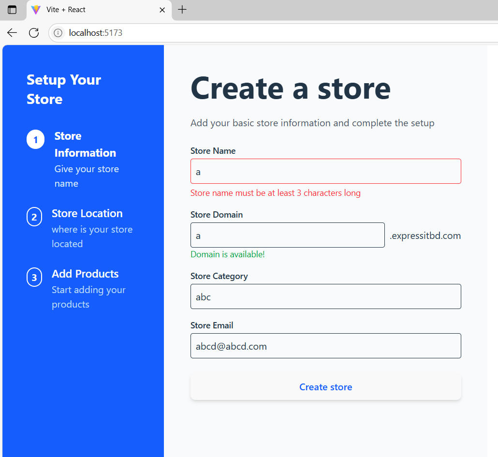
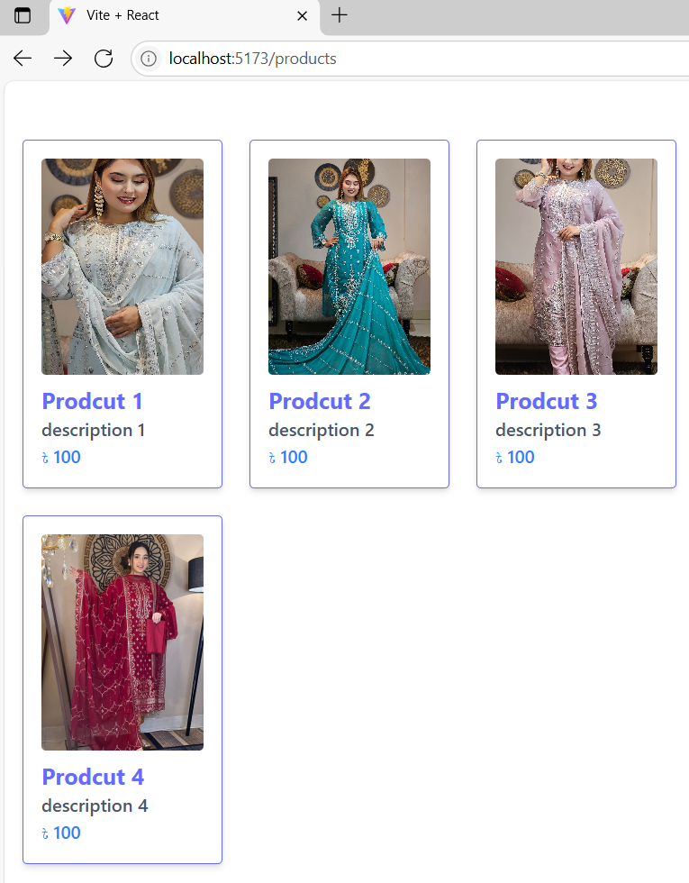
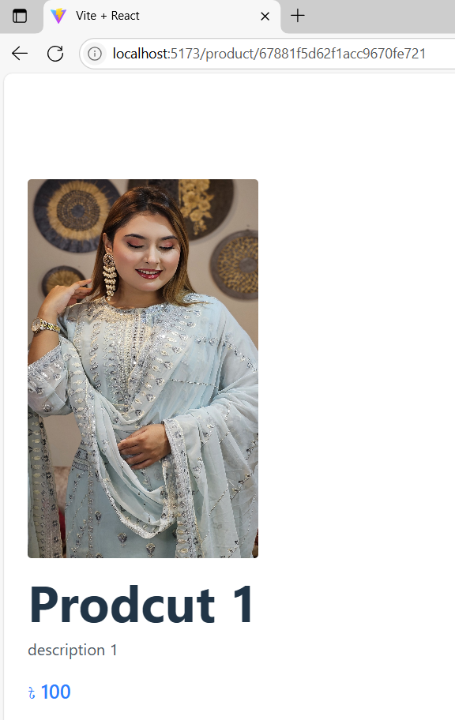

# Online Store Creation with dynamic check api 

1. ✅ Store registration form with full validation and domain availability check via API
2. ✅ Dynamic product display fetched from API
3. ✅ Responsive and clean UI using **React 19** and **Tailwind CSS**


---

## 🚀 Live Demo

👉 [Online store](https://store-creation-with-domain-check.vercel.app/)

---

---
## 🧑‍💻 Technologies Used

- ⚛️ React 19 (with Vite)
- 💨 Tailwind CSS
- 🌐 Axios (for API calls)
- 🧪 Yup & React Hook Form (for form validation)
- 🧑‍💻 JavaScript (ES6+)
- 🌍 Hosted on Vercel
---

---

## 📸 Screenshots

### 📝 Store Registration Page



---

### 🛍️ Product Display Page



---

---

### 🛍️ Product Details Page



---
---

## 📂 Folder Structure
├── public/
├── src/
│ ├── components/
│ ├── pages/
│ ├── App.jsx
│ ├── main.jsx
├── cv.pdf
├── README.md

---

---
Features
✅ Store registration with fields like store name, owner name, phone, email, password, and domain name
✅ Real-time domain availability check via API
✅ Product listing after successful store registration
✅ Responsive design for mobile and desktop
---

---

## 🧑‍💼 Developer Info

- **Name:** Sukanta Nag Hirock  
- **Email:** haridasnag01715511031@gmail.com  
- **GitHub:** [github.com/sukantahirock](https://github.com/sukantahirock)  
- **CV:** [cv](./cv.pdf)

---
---
## 🛠️ Setup Instructions

To run locally:

```bash
git clone https://github.com/your-username/expressit-intern-task.git
cd expressit-intern-task
npm install
npm run dev

